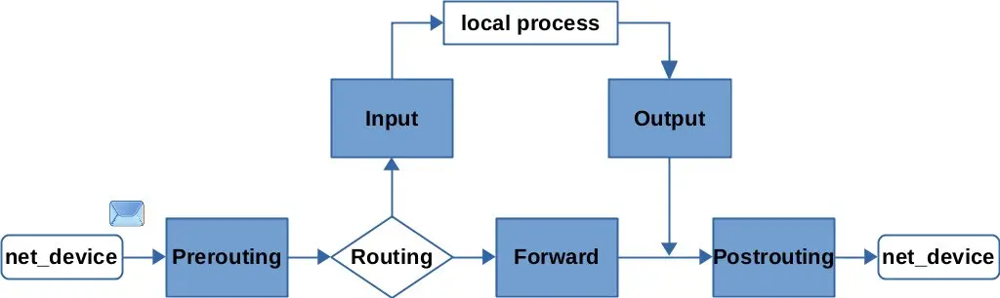

`iptables -t nat -I POSTROUTING -o eth0 -j MASQUERADE`
首先我们解释下这条命令的功能，这条命令的作用是配置 `NAT`，以便所有通过 eth0 接口发送到网络的 IP 包都（伪装）修改它们的源 IP 地址。通常用于私有网络连接到互联网的情况，使得私有网络内的所有机器对外部网络只显示一个公共的 IP 地址。

简单来看就是把当前设备当成路由器，把所有通过当前设备（eth0 网卡）转发出去的数据的源 IP 改写成当前设备的 IP。

首先是这里的改写功能在命令的哪部分体现的？是 `-j MASQUERADE`，这里的 `MASQUERADE` 是 `iptables` 预置的行为之一，作用是自动的修改源或目标的 IP 来做 `NAT`。其它的常见行为还有：

- **DROP**：直接将数据包丢弃。  
- **REJECT**：给客户端返回 Connection Refused 或 Destination Unreachable 报文。 
- **QUEUE**：将数据包放入用户空间的队列，供用户空间的程序处理。
- **RETURN**：跳出当前链，该链里后续的规则不再执行。
- **ACCEPT**：同意数据包通过，继续执行后续的规则。
- **JUMP**：跳转到其他用户自定义的链继续执行。
- **REDIRECT**：在本机做端口映射。
- **MASQUERADE**：地址伪装，自动用修改源或目标的 IP 地址来做 NAT。
- **LOG**：在/var/log/messages 文件中记录日志信息。

iptables 所有的命令最终是要执行上面的行为。

然后再看下前面的参数 `-o eth0`，这个选项指定只有通过 `eth0` 网卡离开本机的数据包生效。相对于对后面执行的行为有一个限定条件，而这个条件➕行为就组成了 iptables 的规则。

iptables 中每条规则都包含了一组匹配条件和一个动作（称为"目标"）。当数据包在链上的流程中和规则的匹配条件相符时，将对其执行规定的动作，如接受（`ACCEPT`）、拒绝（`REJECT`）、丢弃（`DROP`）、转发（`FORWARD`）等。简单来理解规则就是 `if 满足 xxx 条件, then 执行 yyy 行为`。

然后在往前看 `-I POSTROUTING`，这里的 `POSTROUTING` 是 `iptables` 的一个链，什么是链呢，可以认为就是 `iptables` 中的规则的有序集合。`iptables` 已经提前定义好多个内置的链，我们要做的是把规则放到链中。

`iptables` 预定义了 5 个链，这些链就代表数据包在网络栈中经过的不同点。

1. **PREROUTING**：处理进入网络接口但还未被路由选择的数据包
2. **INPUT**：处理即将送往本地进程的数据包
3. **FORWARD**：处理经过本机（当前的Linux系统）正在路由到其他目的地的所有数据包
4. **OUTPUT**：处理本地产生要发送出去的数据包
5. **POSTROUTING**：处理即将离开本机的所有数据包，并且处理发生在路由决策之后

所以我们的命令是把规则加入到 `POSTROUTING` 中，也就是在数据包即将离开本机的时候处理。

最后来看下 `-t nat`，这里指定了 iptables 的 nat 表，那什么是表呢，我们可以认为 iptables 的表就是链的分类集合，通常根据处理数据包的阶段或者目的进行分类。常见的表有 filter（用于过滤数据包），nat（用于网络地址转换），mangle（用于特殊的包处理），和 raw（用于决定数据包是否会被状态跟踪）。

这里可能会有个疑问，貌似通过规则、链好像能实现基本的数据包处理了，为什么还要引入表呢？这里其实是为了管理方便，想象下如果只有链，我需要对发送出去的数据包做不同的处理，那可能就是在一个 OUTPUT 链中有维护 n 条处理规则，到后期维护成本就会很高。而通过 `iptables` 预分类好的表，我们根据处理阶段就知道应该添加到哪张表中，整个规则的维护都会更加的清晰和高效。

来总结下 `iptables` 中表、链、规则的关系，表是链的分类集合，内部包括链；而链是规则的有序集合，内部包括规则。

最后我们再来看下 `iptables` 是什么，`iptables` 是 `Linux` 提供的一个命令行工具，主要用于配置内核提供的 `netfilter` 防火墙功能。也就是说 `iptables` 只是一个配置工具，底层核心能力其实都是 `netfilter` 来实现的，包括核心的预定义链其实都是关联 `netfilter` 的五个同名钩子。不过 `netfilter` 要通过程序编码才够能使用，并不适合系统管理员用来日常运维，而 `iptables` 的价值就是以配置去实现原本用 `netfilter` 编码才能做到的事情。

最后贴下网络栈中 netfilter 5 个钩子的流程。

[参考](https://www.liuvv.com/p/a8480986.html)
