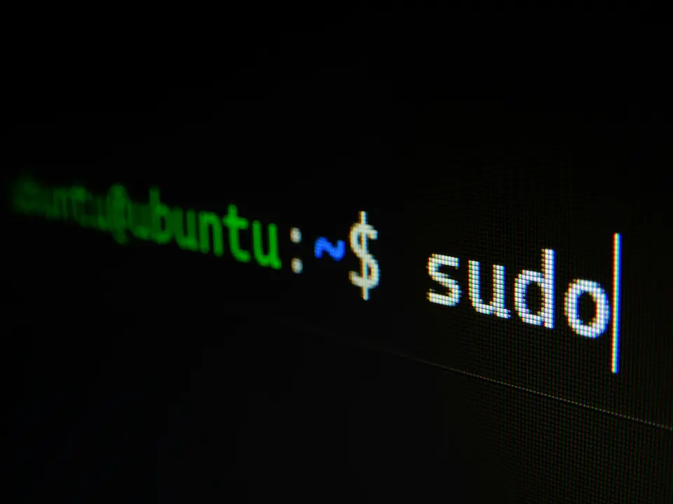
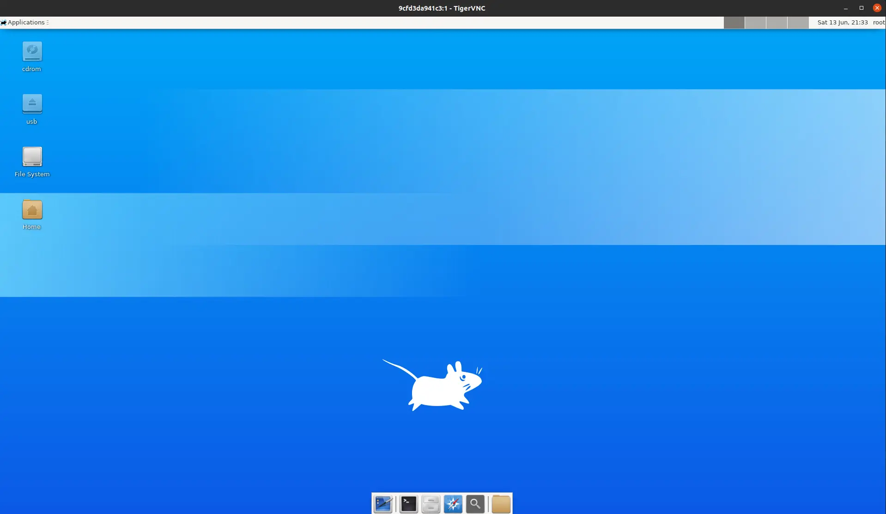
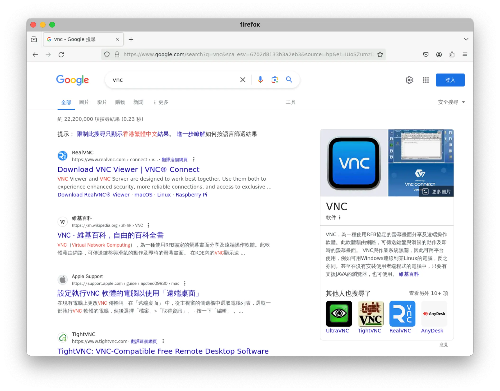

这周发现查资料用的远程windows server 连不上，其实之前就遇到过一次，貌似是因为window server 对远程登录的账号数量有限制，虽然可以通过修改注册表的方式绕过，但是用个半年就会出问题。

这次想着优化下，用 Linux 远程桌面吧，虽然安装折腾点，但是毕竟是一次性成本，装好后就可以长期使用了，算下来还是值得的。

## Debian 安装图形界面和 VNC server

正好阿里云ECS 文档上有教程，就[参考着安装](https://help.aliyun.com/zh/simple-application-server/use-cases/use-vnc-to-build-guis-on-ubuntu-18-04-and-20-04)。

### 账号准备

因为每个 vnc 关联一个登录账号，需要先准备一个登录账号：

```bash
sudo adduser myuser
sudo usermod -aG sudo myuser
getent group sudo myuser
```

这里创建了一个 myuser，并且添加到 sudo 组中。

### 图形环境安装

因为是远程用，这里安装精简的 xfce 桌面。

```bash
sudo apt install xfce4 xfce4-goodies
```

### VNC server 安装配置

首先安装 vnc 软件包：

```bash
sudo apt install tigervnc-standalone-server tigervnc-common
```

然后设置登录密码：

```bash
vncpasswd
```

这里会要确认密码选项，选择 n 就可以。

### 配置 xstartup

这里麻烦点，官方的教程可能太老了不适用，查了一些资料后终于解决了启动问题。
添加 `$HOME/.vnc/xstartup`：

```bash
#!/bin/sh
export XKL_XMODMAP_DISABLE=1
export XDG_RUNTIME_DIR=/run/user/$(id -u)
unset SESSION_MANAGER
unset DBUS_SESSION_BUS_ADDRESS

[ -x /etc/vnc/xstartup ] && exec /etc/vnc/xstartup
[ -r $HOME/.Xresources ] && xrdb $HOME/.Xresources
startxfce4
```

### 启动 VNC server

直接执行以下命令即可启动一个vncserver 实例，如果要长期使用，建议加到 `.profile` 中间中：

```bash
export BROWSER=firefox
vncserver :1 -geometry 1280x720 -depth 24 -securitytypes VncAuth,TLSVnc
```

这里设置分辨率 1280x720，可以根据自己的需要调整，不过不建议调太高，尤其是公网访问的情况下，太高的分辨率卡顿很严重，我自己用 1080 试过，几乎卡成PPT 了。

### 安装中文字体

以上配置好后通过 VNC client 就可以连接上去了，默认启动的是 5900 + server_id 端口，比如第一个 server 就是 5901，通过vnc `ip:5901` 就可以远程连接使用。

不过连上去如果打开中文网站会发现显示乱码，这个是因为没有中文字体支持，所以我们安装下中文字体：

```bash
sudo apt install fonts-wqy-zenhei fonts-wqy-microhei xfonts-wqy
```

这样差不多就能正常访问了，记得安装firefox 浏览器，当然也可以安装其它的，不过需要记得修改 `export BROWSER=firefox` 配置，`xfce4` 默认通过该环境变量来启动浏览器。

## Docker VNC Linux

上面的配置基本满足了远程Linux 访问需求，稍微有点麻烦的是每个用户登录上去都需要配置下vnc server 相关的配置。就想着都是通过vnc 访问，是否可以直接用docker 容器来启动linux 桌面呢，只要配置好一个docker 镜像，后续每个用户只要启动自己的容器即可。按照这个思路在Google 上搜了下还真现成的镜像 [alpine-xfce-vnc](https://github.com/edgelevel/alpine-xfce-vnc)。

这里贴下使用方式：

```bash
# pull latest image
docker run --rm \
  -p 5900:5900 -p 6080:6080 \
  --name alpine-xfce-vnc \
  --hostname alpine \
  edgelevel/alpine-xfce-vnc
```

可以看到使用非常的方便，一个docker 命令搞定，而且启动非常的快。支持 VNC 和 noVNC 两种方式访问。



这个docker 镜像是基于alpine 制作的，对于中文乱码，打开终端安装中文字体即可解决：

```bash
apk add font-wqy-zenhei
```

## 使用 docker-firefox

上面docker 的方案已经很方便了，但是个人稍微有点强迫症，感觉linux 中除了浏览器其它的软件都不需要，尤其是状态栏，壁纸相关，不仅占空间而且会额外影响vnc 的传输效率。基本想法是也不需要安装 `xfce4` 桌面了，直接安装一个浏览器就可以。然后找到了 [docker-firefox](https://github.com/jlesage/docker-firefox) 项目。

该项目其实跟上面的 docker vnc linux 方案差别不大，只是没有安装完整的桌面，使用了精简的 `icewm`，整个容器启动后就是一个浏览器的桌面，非常的简洁。

启动命令：

```bash
docker run -d \
    --name=firefox \
    -p 5800:5800 \
    -v /docker/appdata/firefox:/config:rw \
    jlesage/firefox
```

这里面还有挺多参数可以配置，包括语言、分辨率还有字体等，如果想开箱即用可以用如下命令启动：

```bash
docker run -d \                                                               
    --name=firefox \
    -e DISPLAY_WIDTH=1280 \
    -e DISPLAY_HEIGHT=900 \
    -e LANG=zh_CN.UTF-8 \
    -e TZ=Asia/Shanghai \
    -e ENABLE_CJK_FONT=1 \
    -p 5800:5800 \
    -p 5900:5900 \
    -v `pwd`/firefox:/config:rw \
    jlesage/firefox
```


`ip:5800` 通过浏览器 `noVNC` 访问，`ip:5900` 通过vnc client 访问，推荐通过client 的方式访问，浏览器快捷键操作容器不小心就退出了。

这里有个问题没有解决，系统剪切板共享中文的时候是乱码，`GitHub` 上搜了下也没看到解决方案，后续再研究看看。
