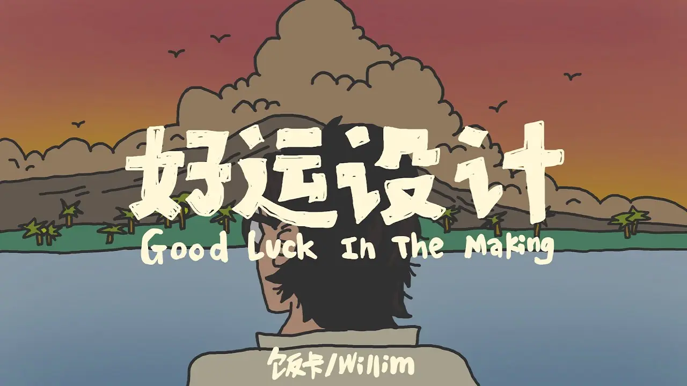

今天在即刻上看到史铁生《好运设计》的节选，里面一段重点论述了“生命的意义在于过程”。这让我顿时有所感触，之前不记得在哪里看到一个观点，主要讲述我们很多人为了将来能过得更好，会选择现在忍受痛苦，但是将来又是不可控的，你现在承受的辛苦，也不见得能换来你想要的未来，我们更应该抓住能掌控的现在。

为什么现在会有所感触，主要还是最近 1、2 年在工作上做了挺多辛苦的付出，但是今年回顾发现自己当初想达到的目标也没达到，反而这两年跟家人相处的时间少了很多，不禁感叹是否值得？

感觉我们观念里面总是强调，为了美好的未来，我们现在应该多吃苦，多付出。但是仔细想下我们的现在，不就是过去的将来吗，我们的现在值得过去辛苦的付出吗，还是说程度不够，时间不够，要十倍、百倍，十年、二十年？

如果以爬山来做类比，那爬到山顶应该就是我们的目标吧。对于一座很难攀登的山，比如华山、泰山，是否只有爬到顶峰才是我们想要的呢？我想爬山的这个过程也是值得我们关注的，如果我们能够以享受的心情，跟身边的家人好友一起，关注一路上的美景，呼吸新鲜的空气，互相扶持着走走停停，一路上拍拍照、打打卡，即使最后没有达到山顶，这个过程就已经是宝贵的经历，我们也已经收获了很多，不仅锻炼了身体，也放松了心情，跟亲人好友共处了美好的时光。反而爬到山顶也只是一刻的满足，如果过程中是痛苦的，那这个收获相对长期的付出反而是不值得的。

经常会忘记自己只是一个普通人，总感觉自己比身边的人更优秀，感觉自己值得更好的将来。也正是这种不切实际的幻想，导致自己一直活的很辛苦，总想要美好的未来，但总是求而不得，或者只能短暂的得到，但是又很快回到这个轮回。我想我应该设个闹钟每天早上提醒自己一遍，你只是一个普通人，接受你的现在，做好你能做的，多关心你身边的人，在做好当下之后，如果有余力可以再为将来多做一点准备，`但是不能为了所谓的美好未来，而牺牲现在`。
