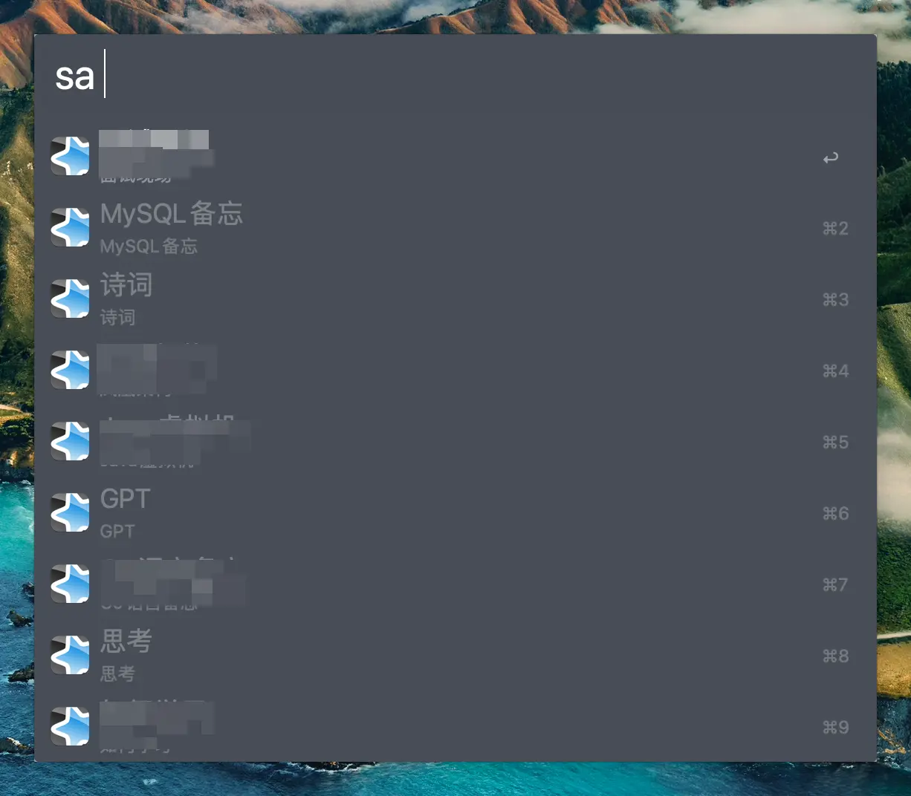
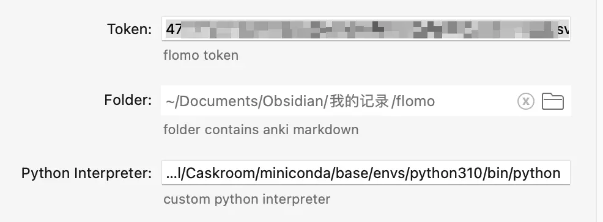
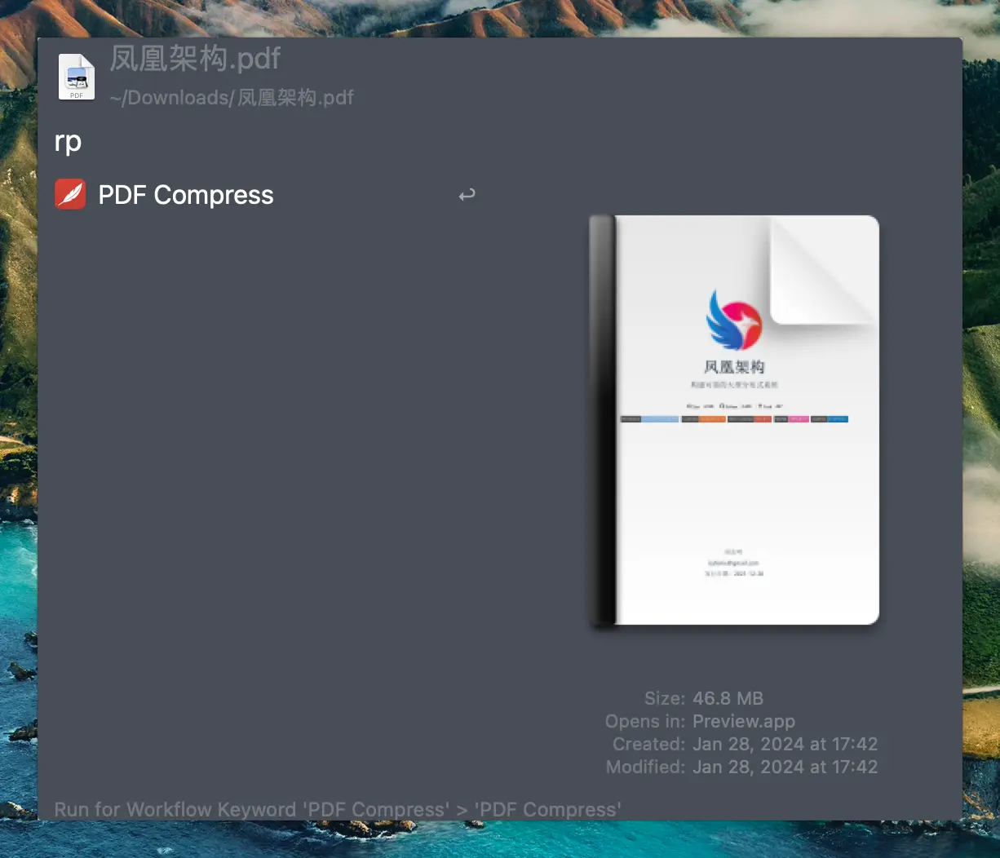
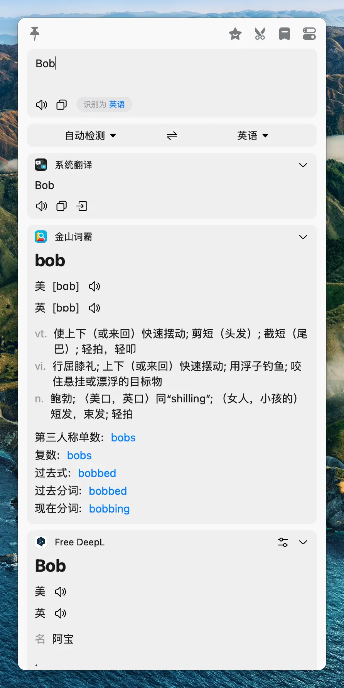
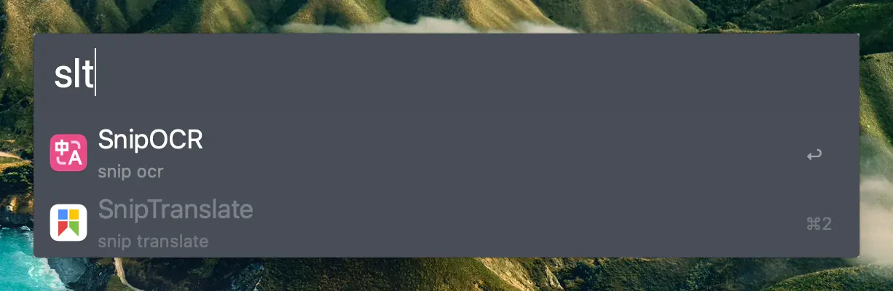

总结下我自己开发的几个[Alfred Workflow](https://github.com/linq/my-workflows)，主要都是效能提升相关。

## Anki 卡片制作

这个 Workflow 主要是对我之前写的 [Obsidian制作Anki卡片](/posts/markdown-to-anki) 的封装，之前开发的是一个Python 脚本，每次执行都需要到命令行不太方便，而且还需要指定具体的Obsidian 路径。

该 Workflow 简化了对应的路径输入，通过 sa 关键词触发后，会列出具体的 Obsidian 中需要同步的笔记，选择好对应的笔记就会自动触发同步。

在 Workflow 中需要配置 Anki 笔记的目录，默认使用系统自带的 Python3，如要要自定义也可以通过 Python Interpreter 指定。

同时由于markdown 制作基于 `markdown2` 和 `requests` 两个库，可以通过 `pip install markdown2 requests` 来安装。

## Flomo 同步

这个也是基于之前的 [同步Flomo卡片到markdown](/posts/flomo-sync) 开发的 Workflow，主要也是为了便于触发 Flomo 同步，避免每次都需要到命令行执行。

主要就 3 个配置，Token 是指定 flomo 的 api token，这个的获取也简单，登录 Flomo 后，在 Cookie 里面即可获取。Folder 指定要同步的目标目录，Python Interpreter 指定要使用的Python 解释器，默认是系统自带的 Python3，同样需要安装依赖：`pip install html2text markdown2`。

## PDF 压缩

这个是因为我会把一些PDF 放到知识库中，但是很多PDF 动辄几十兆，主要是PDF 中的图片比较大，但是一般的图片稍微压缩也不影响阅读，所以我一般都会使用 `PDF Expert` 自带的压缩功能，一般保持 `Medium` 质量即可，像一份 10 多MB 的PDF，经过压缩可以控制在 500KB 左右。

这个 Workflow 的使用方式推荐结合 Alfred 的 `Universial Actions`，比如我会把快捷键设置成 `CMD + \`。这样在Finder 中，选中一个PDF 文件后，输入快捷键，出现的Action 列表就会有 `PDF Compress`，选中之后就会自动触发PDF 压缩。

该 Workflow 是基于 `AppleScript` 开发的自动化脚本，也就是你的电脑需要有 `PDF Expert`，然后在触发后会自动点击对应的菜单执行操作。所以需要你的电脑需要安装 `PDF Expert`。

## Bob 查词

该 Workflow 基于Bob 官方的 `AppleScript` API 制作，支持通过Alfred 触发单词查词、图片OCR 和接入OCR翻译。查词可以结合 Alfred 的 `Universial Actions`，在任意位置选中一个单词后，输入 `CMD + \` 即可查询。

图片 OCR 和接入 OCR 翻译可以在Alfred 中输入 `slt` 关键词触发。

