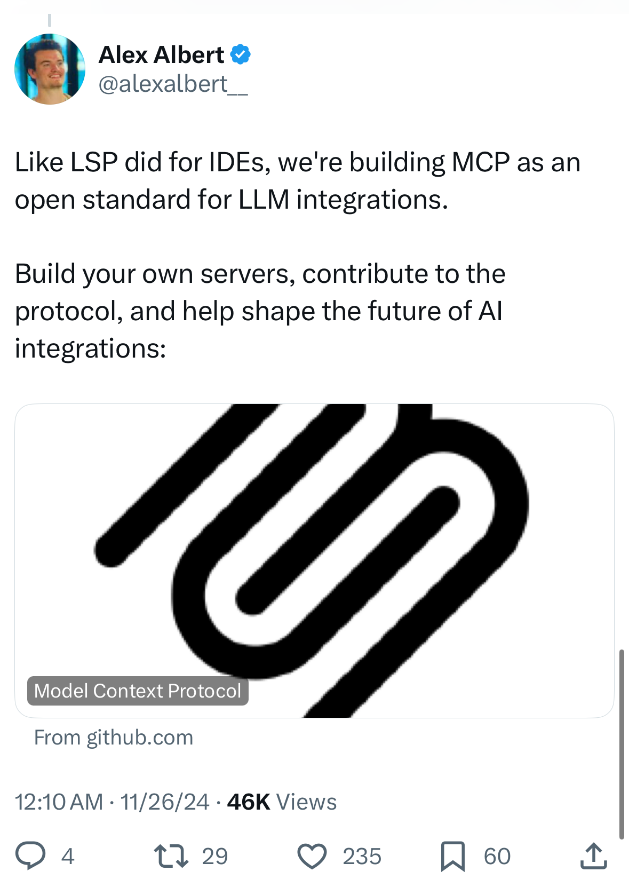
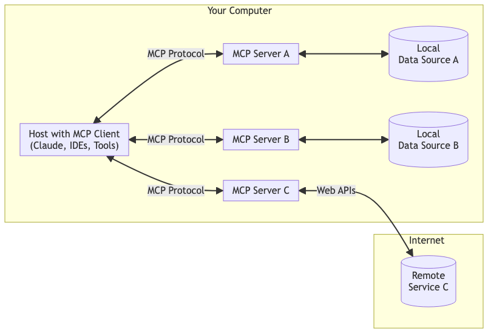
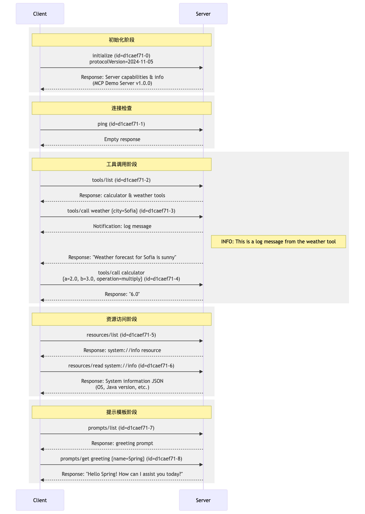
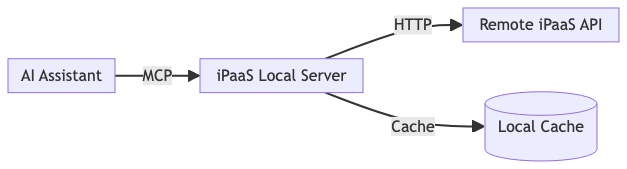
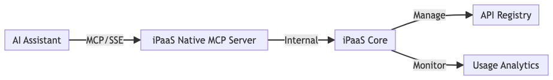

## 一、开场引子

想象这样的场景：

小王是一名开发者，他正在开发一个智能客服系统。这个系统需要：
- 查询公司的产品知识库来回答用户咨询
- 访问订单系统核实客户的购买记录
- 连接 CRM 系统了解用户画像
- 实时获取库存信息...

每增加一个数据源，小王就要写一堆接口代码，还要考虑数据格式转换、访问权限等问题。等系统好不容易开发完成，产品经理又提出要接入新的数据源..."这也太痛苦了！"小王抱怨道，"要是有一个统一的标准就好了。"

好消息是，这个统一的标准已经来了 —— Model Context Protocol（以下简称 MCP）。



2024年11月25日，Anthropic 发布了 Model Context Protocol，这是一个划时代的时刻。这个协议的发布标志着 AI 应用开发进入了一个新的阶段。让我们来看看 Anthropic 是如何描述这个协议的：

> "Model Context Protocol 是一个开源协议，旨在标准化应用程序向大语言模型提供上下文的方式。它就像是 AI 世界的 USB 接口，让不同的数据源和工具能够无缝地与 AI 模型对话。"

这个比喻非常贴切。就像 USB 接口让各种电子设备能够轻松连接一样，MCP 让 AI 模型能够轻松获取它需要的任何信息。无论是本地数据库、云端服务，还是第三方 API，通过 MCP，它们都能以统一的方式与 AI 模型进行交互。


就像当年 USB 接口统一了电子设备的连接方式，让我们不用再为各种接口烦恼一样，MCP 正在重塑 AI 应用与数据的连接方式。今天，我很高兴能和各位同事一起探讨这个革命性的协议。无论你是技术开发者，还是产品运营同学，相信接下来的分享都会让你对 AI 应用的未来有一个全新的认识。

## 二、MCP 是什么

### 2.1 官方定义

MCP（Model Context Protocol）是一个开源协议，它标准化了应用程序向大语言模型（LLMs）提供上下文的方式。你可以把 MCP 想象成 AI 应用的 USB-C 接口：就像 USB-C 为设备连接各种外设和配件提供了标准化方式一样，MCP 为 AI 模型连接不同的数据源和工具提供了标准化的方式。

### 2.2 通俗易懂的解释

对于非技术同学，想象一下你有一个万能助手，能帮你找资料、回答问题、处理各种事务。但这个助手要想发挥最大效能，得知道去哪里找它需要的信息，这就好比你让助手去家里书架（本地数据源）找本书，或者去网上图书馆（远程数据源）搜资料。MCP 就像是给这个助手和各种信息源之间搭建的一条 “超级高速公路”，有了它，助手能快速、顺畅地获取所需，给出靠谱答案。

### 2.3 技术层面定义

从技术角度来看，MCP 本质上是一个开源协议，它为 AI 助手与各类数据系统牵线搭桥，提供一套标准化的接口规范。这意味着，不同公司、不同架构下开发的 AI 应用和五花八门的数据存储，都能依据 MCP 来 “对话”，实现高效的数据交互，让数据流动不再受阻。

## 三、LLM 工具调用的演进历程
在深入理解 MCP 之前，让我们先回顾 LLM 工具调用能力的发展历程。这段进化史让我们更能体会 MCP 带来的革新。

### 3.1 原生 LLM 工具调用时代：直接但繁琐

想象你在一家"自助烹饪"餐厅：虽然厨师给你准备了食材，但你需要自己动手烹饪每一道菜。这就像早期的 LLM 工具调用：

- 开发者需要预定义每个工具（函数）及其参数结构
- 每次调用都要手动处理请求和响应
- 工具数量增加时，代码复杂度呈指数级增长

```python
# 传统工具调用示例
tools = [{
    "name": "search_product",
    "description": "搜索产品信息",
    "parameters": {
        "type": "object",
        "properties": {
            "keyword": {"type": "string"},
            "category": {"type": "string"}
        }
    }
}]

# 需要大量样板代码来处理工具调用
```

### 3.2 框架封装时代：体验提升但仍不够灵活

就像餐厅引入了半自动化设备，LangChain、Vercel AI SDK 等框架的出现让开发者终于不用事事亲力亲为：

- 统一的工具定义和管理
- 自动化的调用执行流程
- 标准化的结果处理

但这种方式仍有局限：所有工具都需要在编译时确定，就像餐厅的设备一旦安装就不能随时更换。

### 3.3 云函数工具时代：迈向动态调用

随着 AI 应用场景爆发，开发者需要更灵活的工具管理方式。早期解决方案包括：
- 使用 eval 或沙盒执行动态代码（国内的DIFY/扣子）
- 通过重新编译部署来增加工具

新兴的工具托管平台（如 Toolhouse）开始提供类云函数服务：
- 在线安装/卸载工具
- 运行时动态获取工具列表
- 自动化执行调用
- 无需重新部署即可使用新工具

### 3.4 MCP 时代：标准化的革新

MCP 的出现标志着 LLM 工具调用进入标准化时代。它不仅继承了前人的优秀实践，更带来了革命性的改变：

- **统一标准**：就像 USB 统一了设备接口，MCP 统一了 AI 工具调用接口
- **即插即用**：通过配置即可动态接入新工具，无需修改代码
- **生态共享**：开发者可以贡献和使用来自全球的工具库
- **安全可控**：标准化的权限和安全机制

对技术团队而言，MCP 意味着更高效的开发流程；对产品运营同学而言，则意味着 AI 功能可以更快速地迭代升级。

## 四、MCP 的架构组成



### 4.1 MCP Hosts

这是我们直接打交道的部分，相当于助手的 “脸” 和 “嘴巴”。像一些桌面端的 AI 应用（如 Claude Desktop）就是 MCP Hosts，我们通过它输入需求，它把我们的指令传递出去，最后再把结果呈现给我们，是人机交互的关键一环。

### 4.2 MCP Clients

从技术角度讲，这是幕后英雄之一。它负责和服务器建立一对一的连接，就像快递小哥，专门把我们的请求准确无误地送到服务器那里，然后再把服务器返回的数据带回来，保障通信的流畅性，确保每个请求都不迷路。

### 4.3 MCP Servers

这是 “数据调度中心”，轻量级的后端服务程序。它依据 MCP 协议把本地或者远程的资源进行整合、调配，对外公开特定功能，让前端的应用（通过客户端）能够轻松获取到想要的数据，决定了数据从哪里来、怎么来。

### 4.4 数据源

数据源分为本地和远程。本地数据源就是咱们电脑里的文件、数据库等，像我们自己整理的项目文档、本地数据库存储的业务数据；远程服务则像是互联网上各种开放的 APIs，比如一些公开的气象数据接口、金融资讯接口等，它们共同构成了 MCP 取之不尽的信息宝库。

## 五、MCP 技术深度解析

### 5.1 传输层实现

MCP 的传输层为客户端和服务器之间的通信提供了基础设施。它采用 JSON-RPC 2.0 作为传输格式，主要支持以下消息类型：

```typescript
// 请求消息格式
{
  jsonrpc: "2.0",
  id: number | string,
  method: string,
  params?: object
}

// 响应消息格式
{
  jsonrpc: "2.0",
  id: number | string,
  result?: object,
  error?: {
    code: number,
    message: string,
    data?: unknown
  }
}
```

最新版本的MCP 支持以下主要方法类型：

1. 生命周期方法
- initialize: 初始化连接
- notifications/initialized: 初始化完成通知
- ping: 连接检查

2. 工具相关方法
- tools/list: 获取可用工具列表
- tools/call: 调用工具
- notifications/tools/list_changed: 工具列表变更通知

3. 资源相关方法
- resources/list: 获取资源列表
- resources/read: 读取资源内容
- resources/templates/list: 获取资源模板列表
- resources/subscribe: 订阅资源变更
- resources/unsubscribe: 取消资源订阅
- notifications/resources/list_changed: 资源列表变更通知

4. 提示词相关方法
- prompts/list: 获取提示词列表
- prompts/get: 获取特定提示词
- notifications/prompts/list_changed: 提示词列表变更通知

5. 日志相关方法
- logging/setLevel: 设置日志级别
- notifications/message: 消息通知

6. 根目录相关方法
- roots/list: 获取根目录列表
- notifications/roots/list_changed: 根目录列表变更通知

7. 采样相关方法
- sampling/createMessage: 创建采样消息


### 5.2 内置传输类型

MCP 提供了两种标准传输实现：

#### 5.2.1 标准输入输出（stdio）
适用场景：
- 构建命令行工具
- 实现本地集成
- 需要简单进程通信
- 处理 shell 脚本

```typescript
// 服务器端示例
const server = new Server({
  name: "example-server",
  version: "1.0.0"
}, {
  capabilities: {}
});

const transport = new StdioServerTransport();
await server.connect(transport);
```

#### 5.2.2 服务器发送事件（SSE）
适用场景：
- 只需要服务器到客户端的流式传输
- 在受限网络环境中工作
- 实现简单的更新机制

### 5.3 协议交互示例




详细传输例子：

#### 获取工具列表

**request**

```json
{"jsonrpc":"2.0","method":"tools/list","id":"11728f1a-2","params":{}}
```

**response**

```json
{"tools":[{"name":"calculator","description":"Performs basic arithmetic operations (add, subtract, multiply, divide)","inputSchema":{"type":"object","properties":{"operation":{"type":"string","enum":["add","subtract","multiply","divide"],"description":"The arithmetic operation to perform"},"a":{"type":"number","description":"First operand"},"b":{"type":"number","description":"Second operand"}},"required":["operation","a","b"]}},{"name":"weather","description":"Weather forecast tool by location","inputSchema":{"city":"String"}}]}}
```

#### 工具调用

**request**

```json
{"jsonrpc":"2.0","method":"tools/call","id":"2040288c-4","params":{"name":"calculator","arguments":{"operation":"multiply","b":3.0,"a":2.0}}}
```

**response**

```json
{"jsonrpc":"2.0","id":"e5dc16a9-4","result":{"content":[{"type":"text","text":"6.0"}],"isError":false}}
```


### 5.4 最佳实践

技术团队在实施 MCP 时，建议遵循以下最佳实践：

1. **生命周期管理**
   - 正确处理连接生命周期
   - 实现资源清理机制
   - 合理设置超时时间

2. **错误处理**
   - 实现完善的错误处理机制
   - 记录传输事件用于调试
   - 实现重连逻辑

3. **性能优化**
   - 处理消息队列的背压
   - 监控连接健康状态
   - 实现消息验证

4. **调试支持**
   - 启用调试日志
   - 监控消息流
   - 检查连接状态
   - 验证消息格式
   - 测试边缘情况

这些技术细节可能对非技术同学来说有些晦涩，但它们正是 MCP 能够支撑企业级 AI 应用的基石。产品经理在规划功能时，可以放心地依赖这些基础设施，专注于业务逻辑的设计。

## 六、MCP 的核心特性与优势

1. **标准化与模块化**：
   - MCP 提供了一种标准化的方式来连接 AI 助手与外部数据源，解决了数据孤岛问题。这种标准化使得开发者可以更轻松地将大型语言模型（LLMs）与各种数据源集成，从而提高开发效率和系统的可扩展性。
2. **双向安全连接**：
   - MCP 支持安全的双向连接，确保数据在传输过程中的安全性和隐私保护。这对于处理敏感数据尤为重要。
3. **多场景应用支持**：
   - MCP 不仅支持本地资源的访问，还支持远程资源的访问，包括文件系统、数据库连接、API 集成等。这使得MCP在多种应用场景下都能发挥作用。
4. **开源与社区支持**：
   - MCP 是一个开源协议，拥有丰富的社区支持和资源库，如本地 MCP 服务器库和开源项目库。这为开发者提供了丰富的工具和文档，降低了开发门槛。
5. **灵活的架构设计**：
   - MCP 采用客户端-服务器架构，允许 LLMs 以服务请求、大模型请求或一般 Tool 请求的形式调用外部数据源。这种灵活性使得 MCP 能够适应不同的需求和场景。

## 七、应用场景

### 7.1 行业应用

#### 7.1.1 金融科技

在金融科技领域，利用 MCP 优化日常业务流程。比如在处理客户的信贷申请时，AI 通过 MCP 快速整合用户银行流水（本地数据源）、信用评级机构数据（远程数据源），瞬间给出精准的风险评估，大大缩短审批时间，提升客户体验，同时降低了人工审核的误差风险，让金融服务更加智能、高效。

#### 7.1.2 自动驾驶

自动驾驶领域，借助 MCP 整合海量数据。一方面，连接车载传感器实时采集的路况数据（本地），另一方面获取交通部门的实时路况信息（远程），AI 依据 MCP 融合分析，为自动驾驶汽车提供最优决策，像是提前规划避堵路线、应对突发路况，让自动驾驶更安全、可靠。

### 7.2 开发工具赋能

#### 6.2.1 Sourcegraph Cody 应用

作为 MCP 的首批支持者之一，Sourcegraph Cody 展示了 MCP 在开发工具中的强大潜力。通过 MCP，Cody 能够：

- **多源数据接入**：
  - 连接 GitHub 或 Linear 的问题追踪系统
  - 访问 Postgres 数据库进行查询优化
  - 读取内部文档和知识库
  - 所有这些都无需离开 IDE 环境

- **数据库开发助手**：
```typescript
// 示例：Cody 通过 MCP 连接 Postgres 数据库
{
  "openctx.providers": {
    "https://openctx.org/npm/@openctx/provider-modelcontextprotocol": {
      "nodeCommand": "node",
      "mcp.provider.uri": "file:///path/to/postgres-server",
      "mcp.provider.args": ["postgresql://connection-string"]
    }
  }
}
```

- **丰富的集成能力**：
  - Brave 搜索 API 集成
  - Google Drive 文档访问
  - Git 历史记录分析
  - 本地文件系统访问
  - SQLite 数据库查询
  - Web 自动化（通过 Puppeteer）

最令人兴奋的是，一旦构建了 MCP 服务器，它就能为多个工具提供上下文支持，不仅限于 Cody。这种标准化的方式让开发者能够更专注于创造性的编码工作，而将繁琐的上下文切换交给 AI 助手处理。

#### 7.2.2 Cloudflare Workers 实践

Cloudflare 通过其 workers-mcp 工具包，大大简化了 MCP 服务器的部署流程。开发者只需几行代码，就能让 AI 助手具备强大的云服务能力。

##### 快速部署示例

```javascript
import { WorkerEntrypoint } from 'cloudflare:workers'
import { ProxyToSelf } from 'workers-mcp'

export default class MyWorker extends WorkerEntrypoint<Env> {
  /**
   * 生成图片的示例工具
   * @param prompt {string} 图片描述文本
   * @param steps {number} 扩散步数，数值越高质量越好但耗时更长
   */
  async generateImage(prompt: string, steps: number): Promise<string> {
    const response = await this.env.AI.run('@cf/black-forest-labs/flux-1-schnell', {
      prompt,
      steps,
    });
    // 图片处理逻辑...
    return new Response(img, {
      headers: { 'Content-Type': 'image/jpeg' }
    });
  }

  async fetch(request: Request): Promise<Response> {
    return new ProxyToSelf(this).fetch(request)
  }
}
```

##### 丰富的应用场景

通过 Cloudflare Workers 和 MCP 的结合，可以轻松实现：
- 使用 Email Routing 发送自动跟进邮件
- 通过浏览器自动化捕获和分享网站预览
- 使用 Durable Objects 存储和管理会话数据
- 查询和更新 D1 数据库
- 直接调用已有的 Workers 服务

##### 开发优势

与传统开发相比，使用 Workers MCP 服务器具有显著优势：
- 无需手动配置服务器实例
- 不用编写详细的 API 模式定义
- 自动处理请求路由
- 简化响应格式化
- 内置通信配置

这种简化的开发方式让产品团队能够快速验证想法，开发团队则可以专注于业务逻辑实现，显著提升了产品迭代效率。

### 7.3 更多应用场景

以下是一些官方 MCP 服务器之外的其他一些支持的场景分类:

📂 - 浏览器自动化
🎨 - 艺术与文化
☁️ - 云平台
🖥️ - 命令行工具
💬 - 通讯工具
👤 - 客户数据平台
🗄️ - 数据库
🛠️ - 开发者工具
📂 - 文件系统
💰 - 金融科技
🧠 - 知识与记忆
🗺️ - 位置服务
📊 - 监控系统
🔎 - 搜索服务
🔒 - 安全工具
🚆 - 交通与运输
🔄 - 版本控制
🛠️ - 其他工具与集成

详细参考：[awesome-mcp-servers](https://github.com/punkpeye/awesome-mcp-servers)

### 官方演示

[MCP 官方演示](https://videocdnv2.ruguoapp.com/lq72YoYcy_-UU10nxPGbpPpPiXVE.mp4?sign=684a6ff888d6a62498ae72d465d3aa5f&t=677e4ac9)

## 八、iPaaS 与 MCP 的融合方案

在探讨完各种应用场景后，让我们具体看看如何将 iPaaS 与 MCP 结合。我们将分析短期和长期两种实施方案，帮助团队根据实际情况做出选择。

### 8.1 短期方案：iPaaS Local Server

这种方案通过开发一个本地 MCP 服务器（ipaa-local-server）来桥接 iPaaS 的远程接口。

#### 8.1.1 架构设计



#### 8.1.2 实现示例

```typescript
// iPaaS Local Server 实现示例
import { McpServer, StdioTransport } from '@anthropic-ai/mcp';

class IPaaSLocalServer extends McpServer {
  private apiClient: IPaaSAPIClient;
  private cache: LocalCache;

  constructor() {
    super({
      name: "ipaas-local-server",
      version: "1.0.0"
    });
    
    this.apiClient = new IPaaSAPIClient({
      baseURL: "https://api.ipaas.example.com",
      apiKey: process.env.IPAAS_API_KEY
    });
    
    this.cache = new LocalCache();
  }

  // 注册 iPaaS API 为 MCP 工具
  async registerIPaaSTools() {
    const apis = await this.apiClient.listAPIs();
    apis.forEach(api => {
      this.registerTool({
        name: api.name,
        description: api.description,
        handler: async (params) => {
          // 检查缓存
          const cachedResult = await this.cache.get(api.name, params);
          if (cachedResult) return cachedResult;

          // 调用远程 API
          const result = await this.apiClient.call(api.name, params);
          
          // 更新缓存
          await this.cache.set(api.name, params, result);
          
          return result;
        }
      });
    });
  }
}

// 启动服务器
const server = new IPaaSLocalServer();
const transport = new StdioTransport();
server.connect(transport);
```

#### 8.1.3 优势
- 本地化优势：解决身份验证与授权问题
- 缓存机制：可以实现本地缓存，减少 API 调用
- 安全性：敏感数据可以本地处理，不需要暴露到云端

#### 8.1.4 局限性
- 维护成本：需要在每个客户端部署和更新本地服务器
- 使用方式：本地server基于标准输入输出，需要使用子进程方式调用，端测不一定能支持
- 一致性问题：本地缓存可能导致数据不一致，部分需要实时性的功能可能无法很好支持

### 8.2 长期方案：iPaaS Native MCP Server

这种方案将 MCP Server 直接集成到 iPaaS 平台中，通过 SSE（Server-Sent Events）提供服务。

#### 8.2.1 架构设计



#### 8.2.2 实现示例

```typescript
// iPaaS Native MCP Server 实现示例
class IPaaSNativeMcpServer extends McpServer {
  constructor() {
    super({
      name: "ipaas-native-mcp",
      version: "1.0.0",
      transport: new SSETransport({
        keepAlive: true,
        reconnectDelay: 1000
      })
    });
  }

  // 实时注册新的 API
  @Subscribe('api.new')
  async onNewAPI(api: APIDefinition) {
    await this.registerTool({
      name: api.name,
      description: api.description,
      handler: async (params) => {
        // 直接调用内部 API
        return await this.internalCall(api.name, params);
      }
    });
    
    // 广播工具列表更新
    this.broadcast('tools/list_changed');
  }

  // 实时监控和分析
  @Monitor()
  async onToolCall(tool: string, params: any) {
    await Analytics.log({
      tool,
      params,
      timestamp: Date.now()
    });
  }
}
```

#### 8.2.3 优势
- 原生集成：作为平台原生功能，维护成本低
- 实时性好：支持实时更新和双向通信
- 集中管理：统一的监控、计费和权限控制
- 扩展性强：可以快速添加新功能和集成新服务
- 一致性好：所有客户端访问相同的服务端点

#### 8.2.4 局限性
- 协议限制：依赖MCP协议的支持，包括身份验证与授权等能力的支持
- 网络依赖：需要网关支持SSE方式，同时数据包符合标准JSON-RPC 2.0数据格式

### 8.3 方案选择建议

1. **短期方案适用场景**：
   - 需要快速验证 MCP 集成效果
   - 本地化需求强烈的场景
   - 对数据隐私要求较高的场景
2. **长期方案适用场景**：
   - 企业级应用部署
   - 需要统一管理和监控
   - 实时性要求高的场景
   - 规模化部署需求
3. **过渡策略**：
   - 可以先采用短期方案快速验证
   - 同时启动长期方案的规划和开发
   - 待长期方案成熟后平滑迁移
   - 保持两种方案的兼容性


## 九、技术挑战与竞争

### 9.1 技术挑战

1. **标准化与兼容性**：
   MCP 试图通过标准化接口实现 LLM 与各种数据源的无缝连接，但这一过程并不容易。目前市场上存在多个竞争协议，如 LangChain、API Gateway 等，这些协议在功能和性能上各有优劣，使得 MCP 的标准化之路充满挑战。此外，不同数据源的多样性和复杂性也增加了实现统一标准的难度。
2. **性能与安全性**：
   MCP 协议需要在保证数据安全的同时，提升模型的响应速度和处理能力。然而，在大规模数据处理和高并发请求场景下，其性能表现仍需进一步验证。此外，如何在开放环境中有效保护用户数据隐私也是一个重要问题。
3. **生态系统的构建与推广**：
   MCP 的成功不仅依赖于技术本身，还需要广泛的社区支持和开发者网络。然而，目前市场上已有多个竞争协议，这可能导致生态系统的分裂，从而影响 MCP 的普及速度和市场接受度。
4. **适配不同数据源的能力**：
   尽管 MCP 支持多种数据形式的交换，包括文件内容、数据库记录、API 响应等，但如何高效地适配不同类型的外部数据源仍是一个技术难题。此外，如何确保在不同场景下数据的一致性和质量也是需要解决的问题。

### 9.2 竞争挑战

1. **与其他协议的竞争**：
   目前市场上已有多个协议试图解决类似问题，如 LangChain、API Gateway 等。这些协议在功能、开放性和生态系统建设方面各有优势，使得 MCP 面临激烈的市场竞争。此外，由于市场上存在多达 14 个竞争协议，MCP 能否成为通用标准仍是一个未知数。
2. **开发者接受度与生态建设**：
   MCP 虽然已经开源并吸引了部分企业（如 Block、Apache）的支持，但其普及仍需时间。开发者对新技术的接受度以及如何构建一个健康的生态系统是 MCP 面临的重要挑战。如果开发者对 MCP 的未来持怀疑态度，可能会导致其难以获得广泛认可。
3. **技术开放性与商业利益的平衡**：
   MCP 的开放性使其能够吸引更多的开发者和企业参与，但这也可能引发一些大型科技公司（如谷歌、微软）的担忧。这些公司可能会通过自己的技术路线或合作模式来对抗 MCP，从而影响其市场地位。

## 十、未来展望

### 10.1 短期挑战与现实考量

虽然 MCP 的愿景令人振奋,但我们也需要保持理性认识:

1. **标准化进程的挑战**
   - 制定一个被广泛接受的协议是个缓慢的过程
   - 面临的不仅是技术问题,更多是商业层面的考量
   - 大型科技公司(如 OpenAI、Apple)是否会接入仍是未知数

2. **过渡期的适应**
   - 目前的 Computer Use 等技术仍将在过渡期发挥作用
   - 需要时间让开发者和企业逐步适应新范式
   - 基础设施建设和工具链完善需要持续投入

### 10.2 长期价值与发展潜力

从长远来看,MCP 的技术路线具有深远的战略意义:

1. **智能体网络的基石**
   - AI 之间通过协议连接成网络是必然趋势
   - 智能体可能实现自组网、自主协商通信协议
   - 有望催生出一个全新的、有别于现有互联网的智能网络生态

2. **开放生态的演进**
   - 开放性是协议发展的核心要素
   - 去中心化的信任机制将得到更多重视
   - 社区驱动的创新将持续涌现

3. **技术融合与创新**
   - 与区块链、DID(去中心化身份)等新兴技术的结合
   - 边缘计算助力数据处理本地化
   - AI 驱动的协议优化与进化

### 10.3 生态建设展望

1. **多方参与的开放生态**
   - 开源社区的持续贡献
   - 学术界的理论突破
   - 企业界的实践创新
   - 标准化组织(如 W3C、IEEE)的规范制定

2. **应用场景的拓展**
   - 从单一工具调用到复杂场景协同
   - 跨平台、跨设备的无缝协作
   - 企业级应用的深度整合

3. **发展建议**
   - 保持开放心态,关注协议演进
   - 在保证安全的前提下推动创新
   - 重视实践反馈,持续优化方案
   - 加强社区协作,共建生态体系

MCP 的未来发展将是一个循序渐进的过程。虽然短期内可能难以达到一些过于乐观的预期,但从长远来看,它代表了 AI 与数据交互的重要发展方向。无论是技术团队还是产品运营,都需要以更务实的心态参与其中,在实践中不断探索和完善,共同推动这项革新性技术的成熟与普及。

## 十一、总结与答疑

今天我们全方位了解了 MCP，从基础概念、架构原理，到实战优势、挑战应对以及未来潜力。希望大家都收获满满，现在开放答疑环节，不管是技术细节、应用思路还是未来畅想，欢迎大家畅所欲言，一起碰撞出更多智慧火花！
